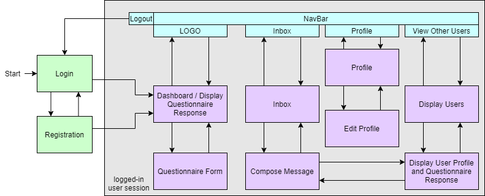
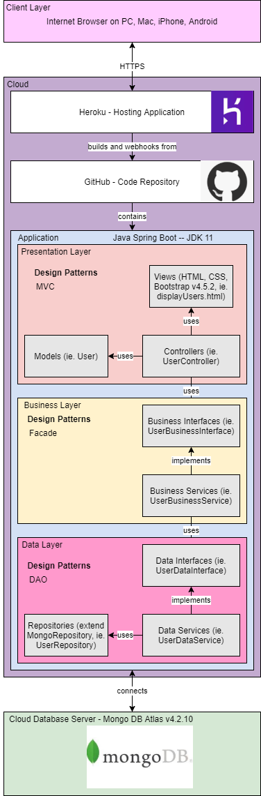

# Roommate Portal

## Introduction

GCU's Student Housing Portal seems to lack a way for students to determine their compatibility as roommates before selecting their housing. This project seeks to simulate an improvement to the existing portal by allowing a user to view other users and their profile information before making housing decisions.

## High-Level Requirements

### Functional
This application supports the following high-level functional requirements
 - Login and Registration
 - User Profile
   - User may include information such as
     - Their year
     - Their major (or double-major) and any minors
     - Their Social media handles, including:
       - Snapchat
       - Instagram
       - Discord
       - Twitter
     - A personal biography 
 - User Questionnaire Response
   - Users may take a questionnaire with questions concerning their rooming preferences, including:
     - Room lighting when sleeping
     - General room temperature
     - noise level at night
     - desired relationship with roommates
     - comfort level with sharing items
     - general bedtime tendency
 - Display Users
   - users may view the profile and questionnaire response of other users on the website
 - In-app Messaging
   - Users may contact each other in the form of in-app emails
   - Users have an 'inbox' which lists messages they have received from other users
   - Users may reply to messages and/or delete messages 
   - Users may send messages directly through the DisplayUser pages. 

### Non-functional
 - Spring Security: Users cannot access any pages aside from the login and registration form pages unless logged into the site first.

## Technologies

- MongoDB Atlas (MongoDB v4.2.10) - To compare relational and non-relational databases
- Spring Boot v2.3.5 - To compare the latest in Java frameworks with vanilla Java Spring
- Apache Maven v4.0.0 - To automate the builing of the java application
- GitHub - To store the source code
- Heroku v18 - To deploy the application
- Java Development Kit v11.0.8 - To compare the university-standard Java 8 with a newer version
- Bootstrap v4.5.2 - To add style to the website
- Thymeleaf v3.0.11 - To compare with the use of Apache Tiles and JSPs
- Visual Studio Code v1.49.3

### Best Practices
- All-Caps Database Table Names
- Facade Design Pattern
- IoC / DI Design Pattern
- DAO Design Pattern
- MVC Design Pattern
- N-Layer Design Pattern

### Cloud Deployment
- Application is deployed to Heroku using their integrated GitHub pipeline.

### DevOps principles
- Logging with Logback and SLF4J
- Aspect Interceptor

## New Technologies

New technologies include:
- Spring Boot
- Thymeleaf
- MongoDB

### Reasons for choosing these technologies
I've created vanilla Java Spring applications in the past, but wanted to compare it with the convention-based structure of Spring Boot. Spring Boot is frequently used in the industry, which further drives my incentive to use this framework. The database technology, MongoDB Atlas v4.2.10, allows for fast and flexible documenting of data created by users in the application. Thymeleaf is a popular, more powerful alternative to the use of Apache Tiles with JSPs, so this application serves to compare these two technologies.

## Technical Approach

### Diagrams

- Class UML example:

Questionnaire Response Functionality

- Sitemap:

- Logical Diagram:

## Risks and Challenges

- Unfamiliar with Spring Boot
- Unfamiliar with MongoDB
- Unfamiliar with Thymeleaf
- Unfamiliar with Spring Security
- Unfamiliar with Visual Studio Code

### Resources for overcoming R&Cs
- Developed Proofs of Concept (POCs) for unfamiliar technologies
- Referenced documentation sources
  - [Spring Boot, Spring Security](https://spring.io/guides)
  - [MongoDB](https://docs.mongodb.com/manual/)
  - [Thymeleaf](https://www.thymeleaf.org/documentation.html)
  - [Visual Studio Code](code.visualstudio.com/docs)
- Referenced technical resource guides from sites including:
  - [Mkyong](https://mkyong.com/)
  - [Baeldung](https://www.baeldung.com/)
  - [DZone](https://dzone.com/)

### Risk Management Approaches
- Developing Proofs of Concept

## Outstanding Issues
- Bugs:
  - Search bar in DisplayAllUsers page does not filter users
  - Spring Security removes line breaks and indentation in messages and replies.
